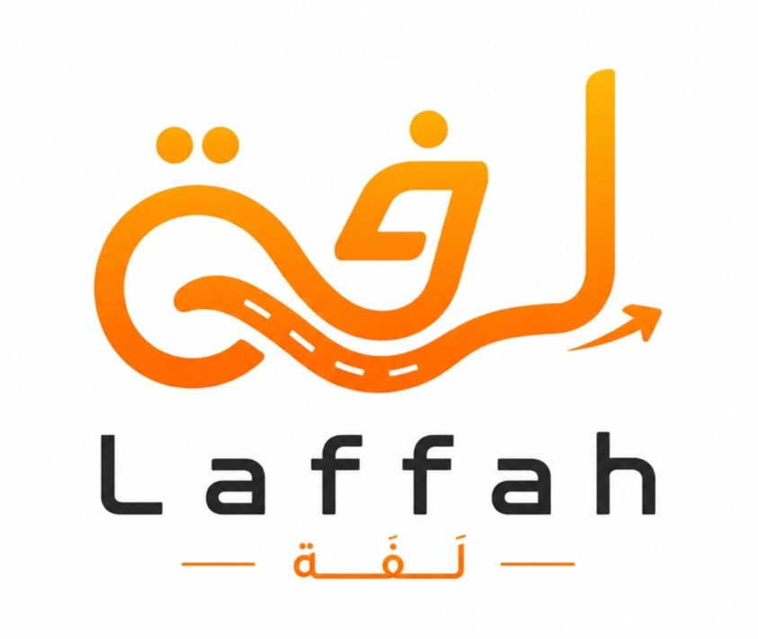

# 🚀 لَفَّة (Laffah) — منصة نقل ذكية وتوصيل طرود

  

  <b>تطبيق نقل وتوصيل ذكي فائق السرعة، مبني بأحدث التقنيات السحابية وتجربة مستخدم لحظية متكاملة.</b>

  
  
  
  
  
  

---

## 🌟 نظرة عامة (Overview)

منصة **"لَفَّة"** هي حل برمجي شامل ومتقدم يربط بين الركاب والكباتن لتقديم خدمات المشاوير وتوصيل الطرود بشكل لحظي ودقيق:
- 📱 **تطبيق الهواتف (Flutter)**: واجهة مستخدم عصرية، سلاسة في الحركة، دعم اللغة العربية والإنجليزية، ونظام تتبع حي بالخرائط.
- ⚙️ **لوحة التحكم والخادم السحابي (Laravel 11 + Livewire 3)**: إدارة شاملة للمستخدمين، الكباتن، الرحلات، المعاملات المالية، التسعير، والإشعارات الفورية.
- 📡 **محرك اللحظية (Laravel Reverb & WebSockets)**: بث مباشر للإحداثيات وتحديثات الطلبات في أجزاء من الثانية.

---

## ✨ أبرز المميزات (Key Features)

### 🚗 للركاب (Passengers):
- **طلب مشاوير فوري ومجدول**: تحديد نقطة الانطلاق والوصول ونقاط التوقف الإضافية بدقة.
- **تسعير عادل ودقيق**: حساب الأجرة بالكيلومتر الحقيقي وفقاً لتسعيرة النظام.
- **توصيل الطرود**: إرسال الطرود بمختلف الأحجام (صغير، متوسط، كبير) مع تسعير نسبي.
- **تتبع مباشر (Live Tracking)**: متابعة مسار الكابتن على الخريطة لحظة بلحظة.
- **محفظة إلكترونية ورموز ترويجية**: دفع نقدي أو عبر المحفظة مع دعم كوبونات الخصم.

### 🛵 للكباتن (Captains):
- **استقبال الطلبات الذكي**: تنبيهات صوتية وإشعارات فورية عند توفر طلب قريب.
- **تتبع عالي الدقة (GPS Stream)**: تحديث موقع الكابتن بالخلفية لضمان دقة الوصول.
- **نظام صفر مديونية (Zero Debt Policy)**: توازن مالي شفاف وحماية لأرباح الكابتن والمنصة.
- **إدارة المستندات والأرباح**: رفع وتوثيق رخصة القيادة والهوية وطلب سحب الأرباح.

### 👑 للإدارة (Admin Panel):
- لوحة تحكم تفاعلية لعرض الخريطة الحية ومراقبة الكباتن المتصلين.
- إدارة الأسعار ونسب الطرود وسجل الرحلات المكتملة والملغاة.
- نظام إشعارات سحابي شامل (Firebase Cloud Messaging).

---

## 🛠️ المعمارية والتقنيات (Tech Stack)

| المكون | التقنية المستخدمة |
| :--- | :--- |
| **Mobile App** | Flutter 3.x, BLoC Architecture, flutter_map, Clean Architecture |
| **Backend API** | Laravel 11.x, Livewire 3, Alpine.js, Tailwind CSS |
| **Real-time Engine** | Laravel Reverb WebSockets, Pusher Protocol |
| **Database** | PostgreSQL (Production) / MySQL |
| **Maps & Geo** | MapTiler Vector Tiles, LocationIQ Geocoding, OSRM Routing |
| **Containerization** | Docker, Docker Compose, Render Blueprint (`render.yaml`) |
| **CI/CD** | GitHub Actions Pipeline |

---

## 📦 روابط التحميل المباشر (Direct Download)

يمكنك تنزيل أحدث إصدار من تطبيق الأندرويد مباشرة عبر صفحة الإصدارات:
👉 **[تحميل تطبيق لَفَّة (GitHub Releases)](https://github.com/AHMEDCODING10/laffah/releases)**

- **النسخة الموصى بها (ARM64-v8a)**: بحجم خفيف وسريع (~23 MB).
- **النسخة الشاملة (Universal APK)**: متوافقة مع جميع المعالجات.

---

## 👨‍💻 المطور (Author)

تم التطوير والإطلاق بواسطة **Ahmed Tamis** ([@AHMEDCODING10](https://github.com/AHMEDCODING10)).
