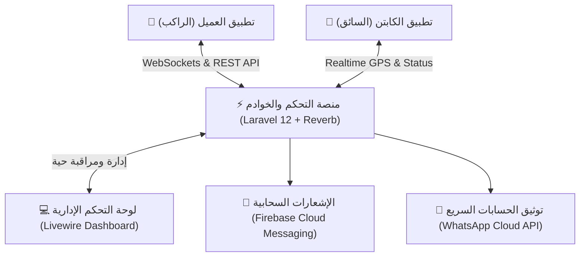
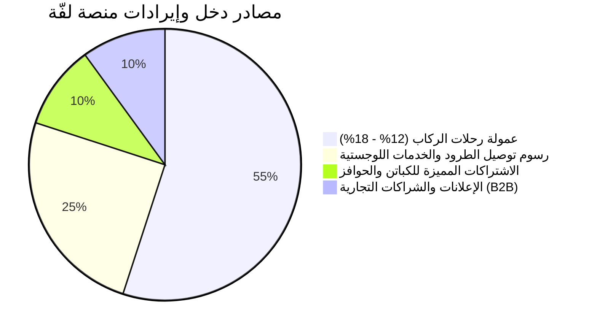

# 📑 التقرير الاستثماري والتحليلي الشامل لمنصة وتطبيق «لفّة» (Laffah)
## المنظومة الذكية لنقل الركاب والتوصيل السريع للطرود
**إعداد الإدارة الفنية والتقنية | موجه إلى: الشركاء والمستثمرين**

---

## 1. الملخص التنفيذي (Executive Summary)

### 1.1 فكرة المشروع ورؤيته
تطبيق **«لفّة» (Laffah)** هو منظومة تقنية متكاملة ونوعية لحلول النقل الحضري الذكي والخدمات اللوجستية السريعة (Ride-Hailing & Express Parcel Delivery)، تم تصميمه وهندسته خصيصاً ليتناسب مع البيئة الحضرية للمدن الكثيفة والمرتفعة الازدحام مثل العاصمة صنعاء والمدن اليمنية الكبرى.

يقدم التطبيق نموذجاً هجيناً فائق الفاعلية يدمج بين:
1. **النقل الذكي للركاب:** بالتركيز العالي على الدبابات والموتوسيكلات (كوسيلة نقل شخصية فائقة السرعة، رخيصة التكلفة، ومثالية لاختراق الاختناقات المرورية) بجانب السيارات الاقتصادية.
2. **التوصيل السريع والفوري للطرود (Express Courier):** تمكين المواطنين، الشركات، والمتاجر الإلكترونية من إرسال واستلام الطرود والوثائق والبضائع من الباب إلى الباب مع تتبع حي ومباشر برمز تحقق رقمي صارم.



### 1.2 المشكلة في السوق والفرصة الذهبية
* **الاختناقات المرورية الحادة:** تعاني الشوارع الرئيسية في صنعاء والمدن الكبرى من زحام متكرر، مما يجعل استخدام سيارات الأجرة التقليدية بطيئاً ومكلفاً جداً.
* **ارتفاع أسعار الوقود وتكلفة المواصلات:** ارتفاع تكاليف البنزين انعكس سلباً على أسعار سيارات الأجرة التقليدية، في حين توفر الموتوسيكلات استهلاكاً اقتصادياً جداً للوقود، مما يتيح تقديم رحلات بأسعار تنافسية تلائم القوة الشرائية للمواطنين مع الحفاظ على هامش ربح مرتفع.
* **غياب خدمات التوصيل الفوري الموثوقة للمستندات والطرود:** أغلب خدمات التوصيل إما غير منظمة أو تتطلب ساعات طويلة أو أيام، بينما يتيح «لفّة» طلب كابتن استلام فوري خلال دقائق معدودة مع كود تتبع لحظي (Tracking Code).
* **ضعف الرقمنة والأمان في سيارات الأجرة العادية:** غياب الشفافية في التسعير وعدم معرفة هوية السائق، بينما يوفر «لفّة» ملفات موثقة بالهويات ورخص القيادة مع تتبع مباشر عبر الأقمار الاصطناعية طوال الرحلة.

---

## 2. مصفوفة الميزات والقدرات الفنية للنظام (System Capabilities & Features)

تم بناء النظام بالكامل وفق أعلى المعايير المعمارية العالمية في تصميم تطبيقات الـ On-Demand.

### 2.1 تطبيق العميل / الراكب (Passenger Application)
1. **تجربة مستخدم فائقة السرعة وعصرية (Modern UX/UI):**
   * دعم كامل للغة العربية والإنجليزية، وتوافق مرئي كامل مع النمط الليلي (Dark Mode) والنمط الفاتح.
   * خريطة تفاعلية ناعمة مع تحديد الموقع بنقرة واحدة وحفظ الأماكن المفضلة (المنزل، العمل، المقاهي).
2. **محرك حجز الرحلات المرن (Flexible Ride Booking):**
   * اختيار نوع المركبة (دباب / موتور، سيارة، توصيل طرد).
   * إمكانية إضافة محطات توقف متعددة (Multi-stop trips) في نفس الرحلة.
   * حاسبة تسعير تقديري دقيقة مسبقة قبل تأكيد الطلب، تُظهر المسافة المتوقعة والوقت المقدر والسعر بدقة بدون مفاجآت.
   * تطبيق كوبونات وعروض الخصم (Promo Codes).
3. **التتبع الحي واللحظي (Real-time Live Tracking):**
   * متابعة حركة الكابتن على الخريطة ثانية بثانية عبر خادم WebSockets محلي فائق السرعة، مع رسم مسار الرحلة الديناميكي وزاوية دوران المركبة التلقائية وفق حركة السائق.
   * شاشة تتبع واضحة تتضمن تفاصيل الكابتن (الاسم، صورة المركبة، رقم اللوحة، نوع المركبة، رقم الهاتف للاتصال المباشر، والتقييم).
4. **نظام توصيل الطرود المبتكر (Express Parcel Delivery):**
   * تحديد موقع الاستلام وموقع التسليم بدقة.
   * إدخال اسم ورقم المستلم، ونوع وحجم الطرد مع ملاحظات تسليم خاصة.
   * توليد كود تتبع أمني فريد (Tracking Code: مثل `LF-89A4B2`) لمتابعة حالة الشحنة لحظياً.
5. **المحفظة الرقمية والدفع (Digital Wallet & Payment):**
   * دعم الدفع نقداً (Cash) أو عبر المحفظة الرقمية المدمجة.
   * شحن رصيد المحفظة عبر الحسابات البنكية ومحفظات الصرافة المحلية.
   * سجل كامل لكافة العمليات المالية والخصومات والشحن.
6. **الأمان والموثوقية:**
   * زر اتصال طارئ وسريع بالكابتن أو الدعم الفني.
   * نظام تقييم متطور (من 1 إلى 5 نجوم) مع ترك تعليقات وملاحظات على الرحلة.

---

### 2.2 تطبيق الكابتن / السائق (Captain Application)
1. **التحكم السلس في حالة العمل (Online / Offline Toggle):**
   * إمكانية تفعيل أو إيقاف استقبال الطلبات بنقرة زر واحدة.
   * رادار ذكي لاستقبال أقرب الطلبات الجغرافية في محيط الكابتن لتوفير الوقود والوقت.
2. **شاشة قبول الطلبات الذكية:**
   * إشعار صوتي فوري واهتزاز عند ورود طلب رحلة جديد.
   * عرض نقطة الانطلاق والوجهة والمسافة الصافية والأجر المتوقع قبل القبول، مع عداد تنازلي للرد.
3. **نظام ملاحة متكامل (Turn-by-Turn Navigation):**
   * توجيه الكابتن إلى موقع الراكب ثم إلى الوجهة النهائية.
   * زر فتح الخريطة الخارجية (Google Maps / Waze) بنقرة زر عند الحاجة.
4. **محفظة الكابتن والحسابات المالية:**
   * حساب تلقائي وفوري للأرباح الصافية بعد خصم عمولة التطبيق لكل رحلة.
   * كشف حساب يومي وأسبوعي بحجم الدخل، عدد الرحلات المنجزة، وساعات العمل.
   * تقديم طلبات سحب الأرباح (Payout Requests) مباشرة من التطبيق إلى إدارة الحسابات.
5. **إدارة وتوثيق الهوية الرقمية (KYC & Documents Verification):**
   * رفع مستندات الهوية، رخصة القيادة، واستمارة المركبة من خلال الكاميرا.
   * مراقبة حالة الاعتماد (قيد المراجعة / معتمد / مرفوض مع ذكر السبب).

---

### 2.3 لوحة التحكم المركزية للإدارة (Admin Dashboard & Control Center)
تم تطوير لوحة التحكم باستخدام أحدث تقنيات **Laravel 12 Livewire** التفاعلية دون الحاجة لإعادة تحميل الصفحات:
1. **خريطة الرادار المباشرة (Live Operations Radar):**
   * شاشة مراقبة حية تُظهر جميع الكباتن المتصلين في شوارع المدينة مع حالاتهم (شاغر / في رحلة / غير متصل) والرحلات الجارية لحظياً.
2. **إدارة الكباتن والتوثيق الأمني (Captains & KYC Management):**
   * مراجعة مستندات الكباتن والتحقق من الهويات واعتماد الحسابات أو حظرها بنقرة زر.
   * مراقبة تقييمات الكباتن وسجل المخالفات أو الشكاوى.
3. **غرفة عمليات الرحلات والطرود (Trips & Parcel Tracking):**
   * سجل شامل لكافة الرحلات وتفاصيلها الجغرافية والمالية مع تتبع أسباب الإلغاء والمسؤول عنها (راكب أم كابتن).
4. **المحرك المالي الشامل (Financial Engine):**
   * تقارير الأرباح الإجمالية وعمولات المنصة اللحظية.
   * إدارة وتدقيق طلبات سحب الأرباح وصرفها بحوالات مالية مع إشعار الكابتن تلقائياً.
   * تعديل أرصدة محافظ المستخدمين والكباتن يدوياً عند الضرورة.
5. **محرك التسعير الديناميكي (Dynamic Pricing Engine):**
   * تحديد سعر فتح العداد الأساسي (Base Fare).
   * سعر الكيلومتر الواحد (Per Kilometer Rate).
   * سعر دقيقة الانتظار (Wait Time Rate).
   * نسبة عمولة المنصة المقتطعة من الكباتن (مثلاً 15%).
   * الحدود الدنيا لرصيد الكابتن لاستقبال الطلبات.
6. **مركز التسويق وحملات الإشعارات (Marketing & Push Center):**
   * إدارة كوبونات الخصم والبروموكود وتحديد نسبتها وصلاحيتها والحد الأقصى للخصم.
   * إرسال إشعارات جماعية دعائية وتنبيهية عبر **Firebase Cloud Messaging** لكافة المستخدمين أو فئات محددة مجاناً وبلا حدود.

---

## 3. البنية المعمارية والتقنية (Technical Architecture)

```
┌────────────────────────────────────────────────────────┐
│                   تطبيقات الهاتف المحمول                 │
│         Flutter (Clean Architecture + BLoC + Dart)     │
└───────────┬────────────────────────────────┬───────────┘
            │ HTTPS REST API                 │ WSS (WebSockets)
            ▼                                ▼
┌────────────────────────────────────────────────────────┐
│                خادم التطبيقات (Application Tier)       │
│           Laravel 12 REST API + JWT Authentication     │
│        Laravel Reverb WebSockets (Real-time Engine)    │
│            Livewire Dashboard (Admin Control)          │
└───────────┬────────────────────────────────┬───────────┘
            │                                │
            ▼                                ▼
┌───────────────────────┐        ┌───────────────────────┐
│     قاعدة البيانات     │        │     الكاش وطوابير     │
│        MySQL 8        │        │      Redis Queue      │
└───────────────────────┘        └───────────────────────┘
            │                                │
            ▼                                ▼
┌────────────────────────────────────────────────────────┐
│               الخدمات السحابية والطرف الثالث            │
│  - Firebase FCM (Push Notifications)                   │
│  - Meta WhatsApp Cloud API (Instant OTP Verification)  │
│  - Location & Routing Engine (MapTiler / Google Maps)  │
└────────────────────────────────────────────────────────┘
```

* **تطبيقات الهاتف (Mobile):** مبنية بإطار عمل **Flutter** كود برمجي موحد لكلا النظامين (Android & iOS) مما يقلل تكلفة التطوير والصيانة بنسبة 50% ويضمن أداءً سلساً بمعدل 60 إطاراً في الثانية.
* **الباك إند وقواعد البيانات (Backend):** مدعوم بـ **Laravel 12** الأكثر استقراراً وأماناً، مع استخدام **JWT (JSON Web Tokens)** للتشفير والتحقق من الهوية وصلاحيات **Spatie RBAC**.
* **الاتصال اللحظي (Real-time Communications):** محرك **Laravel Reverb** المطور بتقنية Non-blocking I/O للاتصال الفوري ونقل إحداثيات المواقع وتحديث حالة الرحلات دون أي ضغط على خادم قاعدة البيانات.
* **نظام التوثيق السريع (OTP Authentication):** إرسال أكواد التحقق الفورية عبر **WhatsApp Cloud API**، وهو الحل الأسرع والأكثر فاعلية في السوق المحلي حيث يتوفر تطبيق واتساب لدى 98% من مستخدمي الهواتف الذكية مع تكلفة تكاد لا تُذكر.

---

## 4. نموذج العمل وتوليد الإيرادات (Business & Monetization Model)

يقوم النموذج المالي لمشروع «لفّة» على تنويع مصادر التدفقات النقدية وتحقيق هوامش ربح متصاعدة:



1. **عمولة رحلات الركاب (Ride Commissions):**
   * اقتطاع نسبة ثابتة تتراوح بين **12% إلى 18%** من إجمالي قيمة كل رحلة منجزة، تخصم تلقائياً من محفظة الكابتن.
2. **رسوم توصيل الطرود السريع (Express Courier Fees):**
   * تعتمد على مسافة التوصيل وحجم الشحنة، مع تحقيق هامش ربح أعلى يصل إلى **20% إلى 25%** نظراً لطبيعة الخدمة الفورية وقيمة المنقولات.
3. **باقات الاشتراك للكباتن (Optional Captain Subscriptions):**
   * إمكانية شراء باقات اشتراك شهرية تعفي الكابتن من عمولة الرحلات مقابل رسم ثابت، مما يوفر تدفقاً نقدياً دورياً ومضموناً للمنصة.
4. **حلول الشركات والمتاجر الإلكترونية (Laffah B2B Solutions):**
   * توقيع عقود توصيل شهرية مع الصيدليات، المطاعم، محلات الملابس والمتاجر الإلكترونية لتوفير أسطول توصيل فوري بأسعار تعاقدية مدفوعة مقدماً.
5. **الإعلانات الموجهة داخل التطبيق (In-App Advertising):**
   * مساحات إعلانية وشراكات استراتيجية مع البنوك، محافظ الصرافة الإلكترونية، والعلامات التجارية المحلية.

---

## 5. خطة النمو والتوسع ومراحل الإطلاق (Go-To-Market & Growth Roadmap)

```
[ المرحلة الأولى: الإطلاق التجريبي (Soft Launch) ]
  • إطلاق الخدمة في النطاق الجغرافي لمدينة صنعاء (الجامعات، المراكز التجارية، الأحياء الحيوية).
  • استقطاب واعتماد 100 إلى 200 كابتن دباب وسيارة.
  • التحقق الميداني من دقة أوقات الاستجابة وأداء السيرفرات.

[ المرحلة الثانية: التوسع والانتشار الجماهيري (Growth Phase) ]
  • إطلاق الحملات التسويقية الرقمية وكوبونات الخصم الترويجية.
  • التوسع ليشمل كامل أمانة العاصمة وضواحيها.
  • الوصول إلى معدل 1,500 إلى 3,000 رحلة يومياً.
  • تدشين بوابة ربط المتاجر الإلكترونية لخدمة الطرود (API Integration).

[ المرحلة الثالثة: التوسع الجغرافي والإقليمي (Expansion Phase) ]
  • التوسع إلى المدن الكبرى الأخرى (إب، تعز، الحديدة، عدن).
  • إطلاق خدمات القيمة المضافة (تأجير، توصيل طلبات جماعية).
```

---

## 6. خلاصة التقييم الاستثماري
يمتلك مشروع **«لفّة»** كافة المقومات التقنية والتشغيلية التي تجعل منه استثماراً عالي العائد منخفض المخاطر:
* **الأصول البرمجية مكتملة ومبنية بالكامل:** التطبيقات ولوحة التحكم والمحرك المالي جاهزة للعمل بنسبة 100%.
* **انخفاض التكاليف التشغيلية الأولية:** يمكن إطلاق المنظمة بتكاليف خوادم وبنية تحتية لا تتجاوز عشرات الدولارات شهرياً.
* **جاذبية السوق المحلي والحاجة الماسة:** قطاع النقل بالدبابات والتوصيل الفوري هو القطاع الأسرع نمواً والأكثر استدامة في ظل التحديات الحضرية الراهنة.
