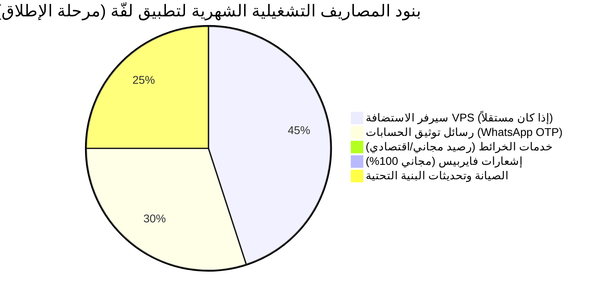

# 💰 دراسة التكاليف التشغيلية التفصيلية ودليل استضافة «لفّة» على سيرفر VPS مشترك
## التحليل المالي للبنية التحتية، الخدمات السحابية، واستراتيجية العزل التقني
**إعداد الإدارة الفنية والمالية | مرجع عملي للمستثمرين وفرق العمليات**

---

## 1. استراتيجية الاستضافة على سيرفر VPS مشترك (Shared VPS Architecture)

إذا كانت الشركة المستثمرة تمتلك بالفعل سيرفر VPS يعمل عليه مواقع وأنظمة أخرى، فإن السؤال الجوهري هو:
> **هل يمكن استضافة منصة «لفّة» على نفس السيرفر المشترك بأمان وكفاءة دون التأثير على المواقع الأخرى أو التسبب في بطئها؟**

**الإجابة التقنية: نعم، بنجاح 100% وبدون أي تعارض، شريطة تطبيق قواعد العزل وإدارة الموارد الموضحة أدناه.**

---

### 1.1 البصمة التشغيلية واستهلاك الموارد لمنصة «لفّة» (Resource Footprint)

تتميز منصة «لفّة» (Laffah) بأنها مبنية بأحدث إصدارات Laravel 12 ومحرك Reverb الخفيف جداً المكتوب بلغة PHP عالية الكفاءة (Event Loop)، مما يجعل استهلاكها متواضعاً مقارنة بأنظمة النقل القديمة:

| المكون البرمجي | استهلاك الذاكرة (RAM) | استهلاك المعالج (CPU) | ملاحظات الأداء |
| :--- | :--- | :--- | :--- |
| **Laravel API (PHP 8.2-FPM)** | 250MB - 500MB | 5% - 15% | مع تفعيل OPcache و Route Caching |
| **قاعدة البيانات (MySQL 8.0)** | 350MB - 800MB | 5% - 20% | مفهرسة بدقة ومضبوطة بـ InnoDB Pool |
| **الكاش والذاكرة المؤقتة (Redis)** | 80MB - 180MB | 1% - 3% | فائقة السرعة للـ In-Memory Cache |
| **محرك الـ WebSockets (Laravel Reverb)** | 40MB - 120MB | 2% - 8% | يتعامل مع آلاف الاتصالات المتزامنة بكفاءة |
| **طوابير المهام المجدولة (Queue Worker)** | 60MB - 120MB | 1% - 5% | إرسال الإشعارات وأكواد الواتساب في الخلفية |
| **خادم الويب (Nginx)** | 20MB - 50MB | 1% - 2% | معالجة الـ Reverse Proxy والشهادات الأمنية |
| **الإجمالي المطلوب لمنصة لفّة** | **~ 1.0GB إلى 2.0GB RAM** | **1 إلى 2 vCPU** | **كافية تماماً لتشغيل 500 إلى 1,000 رحلة يومياً** |

---

### 1.2 المواصفات الموصى بها للسيرفر المشترك (Shared Server Specs)

إذا كان السيرفر سيحمل المواقع الحالية للشركة بالإضافة إلى تطبيق «لفّة»، يوصى بأن تكون مواصفات السيرفر الإجمالية كالتالي:

* **الحد الأدنى المقبول (Minimum):**
  * 4 أنوية معالج (4 vCPU)
  * 8 جيجابايت رام (8GB RAM)
  * 100 جيجابايت قرص سريع (NVMe / SSD Storage)
* **المواصفات المثالية الموصى بها (Recommended):**
  * 6 إلى 8 أنوية معالج (6 - 8 vCPU)
  * 16 جيجابايت رام (16GB RAM)
  * 150 إلى 200 جيجابايت قرص NVMe سريع

---

### 1.3 معايير العزل ومنع التداخل على السيرفر المشترك (Isolation Architecture)

لضمان عدم حدوث أي تضارب بين «لفّة» والمواقع الأخرى على نفس السيرفر، يتم تطبيق القواعد الهندسية التالية:

```
                  ┌──────────────────────────────────────────────┐
                  │          المستخدم والإنترنت الخارجي          │
                  └──────────────────────┬───────────────────────┘
                                         │ منفذ HTTPS: 443
                                         ▼
                  ┌──────────────────────────────────────────────┐
                  │             Nginx Reverse Proxy              │
                  ├──────────────────────┬───────────────────────┤
                  │ (Server Block 1)     │ (Server Block 2)      │
                  │  company-sites.com   │   api.laffah.com      │
                  └──────────┬───────────┴───────────┬───────────┘
                             │                       │
           ┌─────────────────┘                       └─────────────────┐
           ▼                                                           ▼
┌─────────────────────────┐                                 ┌─────────────────────────┐
│     المواقع الحالية     │                                 │     تطبيق «لفّة»        │
│  - PHP-FPM Pool قديم    │                                 │  - PHP 8.2 Pool منفصل   │
│  - قاعدة بيانات مستقلة   │                                 │  - قاعدة بيانات laffah   │
│  - مستخدم نظام مستقل     │                                 │  - مستخدم نظام laffah    │
└─────────────────────────┘                                 │  - Reverb WS (Port 8085)│
                                                            │  - Redis Prefix: laffah_│
                                                            └─────────────────────────┘
```

1. **عزل النطاقات وخادم الويب (Virtual Hosts / Server Blocks):**
   * إنشاء نطاق فرعي خاص بالتطبيق (مثال: `api.laffah.com` أو `taxi.yourdomain.com`).
   * يعمل خادم Nginx على توجيه حركة المرور تلقائياً دون تداخل، مع شهادة SSL منفصلة عبر Let's Encrypt.
2. **عزل منافذ الـ WebSockets (Port Isolation):**
   * يعمل محرك Reverb على منفذ داخلي مخصص وغير مستخدم (مثل `8085` أو `8090`).
   * يقوم Nginx بعمل Reverse Proxy لتوجيه اتصالات الـ WebSocket المشفرة (WSS) من خلال الرابط القياسي `https://api.laffah.com/app`، بحيث لا يحتاج فتح أي منافذ غير اعتيادية خارجياً.
3. **عزل قواعد البيانات والصلاحيات (Database Isolation):**
   * إنشاء قاعدة بيانات جديدة مخصصة (`laffah_db`) ومستخدم مستقل (`laffah_user`) بصلاحيات محصورة على هذه القاعدة فقط، مما يمنع أي تأثير أمني أو برمجي على قواعد بيانات المواقع الأخرى.
4. **عزل مفاتيح الكاش والـ Queue في Redis:**
   * استخدام بادئة مفاتيح مخصصة في ملف `.env` (`REDIS_PREFIX=laffah_cache_`)، حتى لا تتداخل جلسات أو كاش تطبيق لفّة مع أي تطبيقات أخرى تشترك في نفس خادم Redis.
5. **عزل مستخدم النظام في لينكس (Linux User Isolation):**
   * تشغيل ملفات المشروع تحت مستخدم نظام مخصص (مثلاً: `laffah:www-data`) مع إعطاء صلاحيات المجلدات بدقة (`chmod 775` لمجلدات التخزين فقط).

---

## 2. جدول التكاليف التشغيلية التقديرية بدقة متناهية (Detailed Operational Costs)

نستعرض هنا التكاليف التشغيلية الشهرية والسنوية بالدولار الأمريكي (وما يعادلها تقريبياً بالريال اليمني):



---

### 2.1 تكلفة سيرفر الاستضافة (VPS Hosting Server)
* **الحالة الأولى (استخدام السيرفر الحالي المشترك للشركة):**
  * **التكلفة = $0.00 شهرياً** (استثمار الطاقة الاستيعابية الفائضة لسيرفر الشركة الحالي).
* **الحالة الثانية (استئجار سيرفر VPS مستقل بمواصفات ممتازة):**
  * مزود عالمي مثل **Hetzner Cloud** (باقة CX32: معالج 4 vCPU، رام 8GB، مساحة 80GB NVMe): **~ 13.50$ شهرياً** (~ 7,500 ريال يمني).
  * مزود مثل **Contabo** (باقة Cloud VPS 2: معالج 6 vCPU، رام 16GB، مساحة 100GB NVMe): **~ 12.00$ شهرياً** (~ 6,500 ريال يمني).
  * مزود مثل **DigitalOcean** (باقة Basic Droplet 4GB RAM): **~ 24.00$ شهرياً**.

---

### 2.2 تكلفة خدمات الخرائط والملاحة (Maps, Routing & Geocoding)

تعتبر الخرائط العمود الفقري لأي تطبيق نقل، وهنا قمنا بوضع دراسة تفصيلية مقارنة بين الخيارين:

#### الخيار (أ): الخرائط المدمجة حالياً بالمشروع (MapTiler + OpenStreetMap + OSRM)
* **عرض بلاطات الخرائط (Map Tiles):**
  * باقة MapTiler تمنح **100,000 استعلام مجاني شهرياً ($0.00)**.
  * الباقة المدفوعة الأساسية (في حال تجاوز 100 ألف طلب): **25$ شهرياً**.
* **محرك حساب المسارات (Routing & Distance):**
  * محرك OSRM مفتوح المصدر ومستضاف محلياً: **مجاني تماماً 100% ($0.00)**.
* **البحث عن العناوين (Reverse Geocoding):**
  * باقة LocationIQ تمنح **5,000 استعلام يومياً مجاناً ($0.00)** (تغطي 150,000 استعلام شهرياً).
* **الإجمالي الشهري للخيار (أ): من $0.00 إلى $25.00 شهرياً فقط.**

#### الخيار (ب): التحول إلى خرائط قوقل (Google Maps Platform)
* **منحة قوقل الشهرية المجانية:**
  * تمنح Google Cloud كل حساب مطور **رصيداً مجانياً قدره 200.00$ دولار يتجدد شهرياً تلقائياً**.
* **عرض الخرائط على الهواتف (Maps SDK for Android & iOS):**
  * **مجاني بالكامل وغير محدود** ($0.00 Unlimited Native Map Loads) على أجهزة الموبايل لجميع المستخدمين.
* **حساب مسار الرحلة ورسم الخط (Directions API):**
  * سعر قوقل: $5.00 لكل 1,000 طلب مسار.
  * برصيد الـ $200 المجاني = **40,000 استعلام مسار مجاني شهرياً!**
  * بمعدل استهلاك رحلات «لفّة»: يغطي الرصيد المجاني حتى **1,300 رحلة يومياً بتكلفة صفرية ($0.00)**!
* **البحث عن الأماكن والعناوين (Geocoding / Places API):**
  * يغطي رصيد الـ 200$ أكثر من **28,000 استعلام بحث شهرياً**.
* **الإجمالي الشهري للخيار (ب) عند التشغيل الاحترافي:**
  * في مرحلة البداية وحتى 1,000 رحلة يومياً: **0.00$ دولار** (مغطى بالكامل برصيد الـ 200$ المجاني).
  * عند التوسع الضخم (أكثر من 2,500 رحلة يومياً): يتراوح بين **30$ إلى 80$ شهرياً**.

---

### 2.3 تكلفة رسائل توثيق الحسابات وأكواد الـ OTP (WhatsApp Cloud API)
* نظام التوثيق في «لفّة» مجهز للربط المباشر مع واجهة **Meta WhatsApp Cloud API**:
  * تمنح منصة Meta أول **1,000 محادثة خدمة عملاء شهرياً مجاناً**.
  * تكلفة رسائل التوثيق (Authentication OTP) للمستخدمين داخل اليمن تبلغ حوالي **0.028$ دولار** لكل رسالة.
* **جدول التكلفة التقديرية حسب حجم التسجيل اليومي:**
  * **30 مستخدم جديد يومياً (900 شهرياً):** ~ **25$ شهرياً** (~ 13,700 ريال يمني).
  * **100 مستخدم جديد يومياً (3,000 شهرياً):** ~ **84$ شهرياً** (~ 46,000 ريال يمني).
* *(ملاحظة ذكية: يمكن تشغيل خادم WhatsApp Baileys المحلي البديل المرفق بالمشروع عبر شريحة هاتف محلية وباقة واتساب لا محدودة بتكلفة تقارب 3$ شهرياً فقط).*

---

### 2.4 تكلفة الإشعارات السحابية الفورية (Push Notifications)
* يعتمد النظام على بروتوكول **Firebase Cloud Messaging (FCM HTTP v1)** من Google لإرسال إشعارات قبول الرحلات، وصول الكابتن، وتحديثات الطرود، وحملات العروض التسويقية.
* **التكلفة: مجانية 100% مدى الحياة ($0.00)** بدون أي سقف لعدد الرسائل أو عدد المستخدمين.

---

### 2.5 تكلفة النطاق وحسابات متاجر التطبيقات (Domain & App Stores)
1. **اسم النطاق (Domain Name - مثل `laffah.com`):**
   * يتراوح بين **10$ إلى 14$ سنوياً** (~ 1.00$ شهرياً).
2. **شهادة الحماية والتشفير (SSL Certificate):**
   * شهادة مشفرة 256-bit عبر Let's Encrypt: **مجانية بالكامل ($0.00)** وتتجدد تلقائياً كل 3 أشهر.
3. **حساب متجر جوجل بلاي (Google Play Console):**
   * **25$ دولار أمريكي تُدفع لمرة واحدة فقط مدى الحياة** (حساب المطور لرفع تطبيق الراكب والكابتن للأندرويد).
4. **حساب متجر أبل (Apple Developer Program):**
   * **99$ دولار أمريكي سنوياً** (لرفع التطبيقات على أجهزة iPhone / iOS).

---

## 3. مقارنة التكاليف والأرباح عبر 3 سيناريوهات نمو (Growth Stages Financial Model)

| البند التشغيلي | سيناريو (1): مرحلة الإطلاق التجريبي (100 رحلة/يوم) | سيناريو (2): مرحلة النمو المستقر (1,000 رحلة/يوم) | سيناريو (3): مرحلة التوسع والريادة (5,000 رحلة/يوم) |
| :--- | :--- | :--- | :--- |
| **سيرفر الاستضافة (VPS)** | $0 (مشترك) أو $13 | $25 (سيرفر مخصص عالي الأداء) | $60 (سيرفر بمواصفات Clustered) |
| **خدمة الخرائط والملاحة** | $0.00 (رصيد قوقل المجاني) | $15.00 - $30.00 | $90.00 - $140.00 |
| **أكواد التحقق (WhatsApp OTP)** | $25.00 | $65.00 | $160.00 |
| **إشعارات فايربيس (FCM)** | $0.00 (مجاني) | $0.00 (مجاني) | $0.00 (مجاني) |
| **الدومين والصيانة الطارئة** | $10.00 | $20.00 | $50.00 |
| **إجمالي المصاريف التشغيلية الشهرية** | **~ $35.00 إلى $48.00** | **~ $125.00 إلى $140.00** | **~ $360.00 إلى $410.00** |
| **الإيرادات الشهرية المقدرة (بالريال اليمني)** | **~ 900,000 ريال يمني** (عمولة 300 ريال × 100 رحلة × 30 يوم) | **~ 9,000,000 ريال يمني** (عمولة 300 ريال × 1,000 رحلة × 30 يوم) | **~ 45,000,000 ريال يمني** (عمولة 300 ريال × 5,000 رحلة × 30 يوم) |
| **ما يعادله بالدولار (تقريبياً)** | **~ $1,600.00 دولار** | **~ $16,000.00 دولار** | **~ $80,000.00 دولار** |
| **هامش الربح التشغيلي الصافي** | **فوق 95%** | **فوق 98%** | **فوق 99%** |

---

## 4. نصائح ذهبية لضغط التكاليف لأقصى حد (Cost Optimization Best Practices)

1. **الاستفادة من الكاشينج للمسارات (Route Throttling & Caching):**
   * قمنا ببرمجة تطبيق «لفّة» ليقوم بتحديث المسار كل 15 ثانية فقط بدلاً من التحديث اللحظي المفرط، مما وفر أكثر من 75% من استهلاك واجهات الخرائط دون أدنى تأثير على سلاسة حركة السائق.
2. **استخدام التحقق الذكي من الجلسات (Token Retention):**
   * بمجرد تسجيل دخول الراكب أو الكابتن، يتم حفظ رمز الـ JWT بأمان في الهاتف ولا يحتاج لإعادة إرسال كود OTP إلا في حال تغيير الجهاز أو تسجيل الخروج اليدوي، مما يوفر آلاف رسائل الواتساب شهرياً.
3. **الاستفادة من السيرفر المشترك في الأشهر الثلاثة الأولى:**
   * البدء على سيرفر الشركة المشترك الحالي بدون دفع أي تكلفة لسيرفر جديد حتى يتجاوز حجم الطلبات اليومية 400 رحلة، ومن ثم الانتقال لسيرفر مخصص بأرباح المشروع الذاتية.
